# AltstadtAuto: the Old Town

**The world of AltstadtAuto, as free, MIT-licensed code you can run, read and bring into your own game.**
By Louis Nordbø. Play the game at **[wta.lou15.com](https://wta.lou15.com)**.

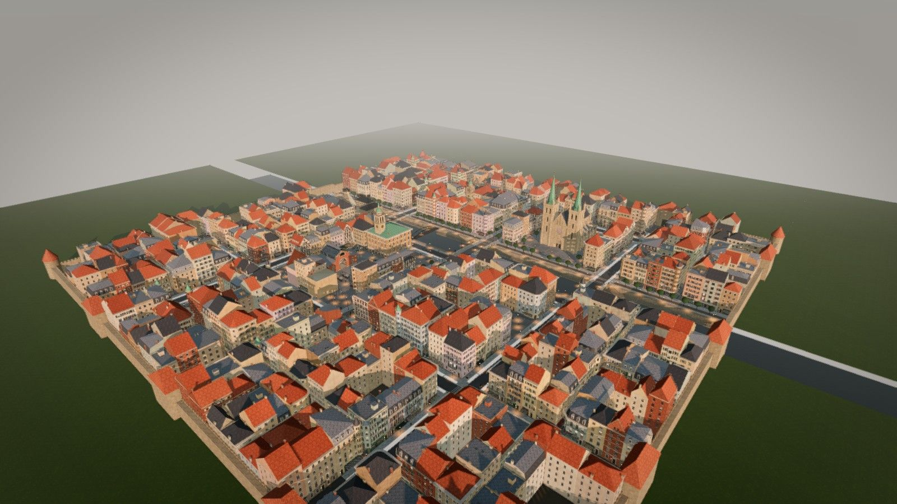

- [The game](#the-game)
- [The Old Town](#the-old-town)
- [Gallery](#gallery)
- [What is in this repository](#what-is-in-this-repository)
- [How to use it](#how-to-use-it)
- [For Matt and BridgeMind: bringing it into BridgeZone](#for-matt-and-bridgemind-bringing-it-into-bridgezone)
- [Coordinates and units](#coordinates-and-units)
- [Where the code comes from](#where-the-code-comes-from)
- [License and credit](#license-and-credit)
- [Thank you](#thank-you)

## The game

AltstadtAuto is Louis Nordbø's open-world game that runs in the browser. You arrive in a dense
European old town at dusk and do as you please: walk the cobbled lanes, drive the town's cars,
ride a scooter along the river, and see how the town reacts.

- **Original vehicles**: a city hatch, a boxy classic, a saloon, an estate, a coupe, a delivery
  van, a taxi and the Stadtwache police estate, with number plates, interiors and lamps that glow
  at dusk, plus rideable scooters parked along the lanes.
- **People who think**: they see and hear what happens, run or take cover, warn each other,
  remember who hurt them, phone the police and help the injured. In calm times they sit at cafes,
  browse the market and rest by the river.
- **Police and HEAT**: officers need to see you, radio where you were last seen, search outward,
  flank in pairs and arrest at low heat. A HEAT meter with police-light pips shows how hot you are.
- **Coming in Alpha 3** (already on the game's main branch, not yet released): the
  Stadtgefängnis, the town jail on its river island, with arrests, bail and four ways to escape;
  cash machine robbery and pickpocketing.
- **Multiplayer** lobbies of up to 16 players with invite codes, on Louis's own server. It plays
  solo when the server can't be reached.
- **Made for the game**: its own music ("Old Town, Golden Hour" and "Old Town, Lamplight"), its
  own sound effects, its own typefaces (WTA Display and WTA Text), its own dialogue.
- **Modes** next to the main game: Sandbox on the Freight Yard and Survival on the Citadel.
- **Versions** so far: Alpha 1 (0.1.0) to Alpha 2.1 (0.2.1), with Alpha 3 in progress.
- **Tech**: three.js 0.169 and Rapier physics, plain ES modules, no build step. Everything, from
  the town to the textures, the cars and the sounds, is generated in code.

The full game is closed source, made by Louis Nordbø. Play it at
[wta.lou15.com](https://wta.lou15.com). This repository is the open part: the Old Town map
component the game uses, given away for free under the MIT License.

## The Old Town

The Old Town is the game's main map, and this repository is that map on its own, as a free
component: a procedural
central European old town at dusk. A river runs through it under three-arch stone bridges and an
iron footbridge, with quays and stairs down to the water and a promenade of lindens along the
north bank. Cobbled lanes and alleys wind between 469 townhouses of four to six storeys in
stucco, stone, brick and half-timber, with shops, cafes, bakeries and painted signs on their
ground floors. There is a market square with a fountain and an iron-and-glass market hall, a
Gothic cathedral with twin copper spires on its own square, a town hall with a clock tower, a
bell tower over a little cafe square, a crenellated town wall with gate towers, and a jail on an
island in the river.

Nothing here is a model or an image file. The whole town, every window, roof, cobble texture and
lantern, is generated in code from a seed, in the browser, in a few seconds.

## Gallery

From the game (AltstadtAuto, Ultra quality, the town's own evening light, rendered headless):

| | |
|---|---|
| 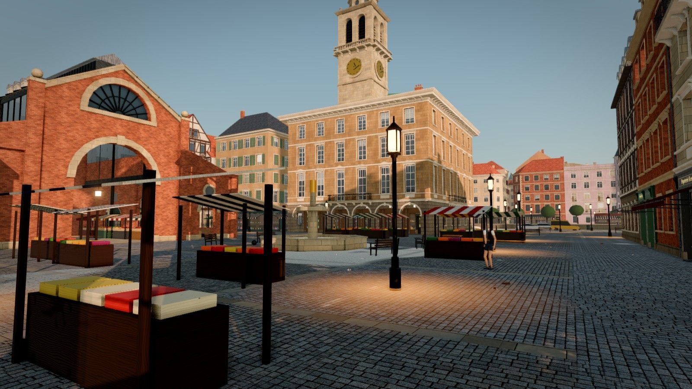 | 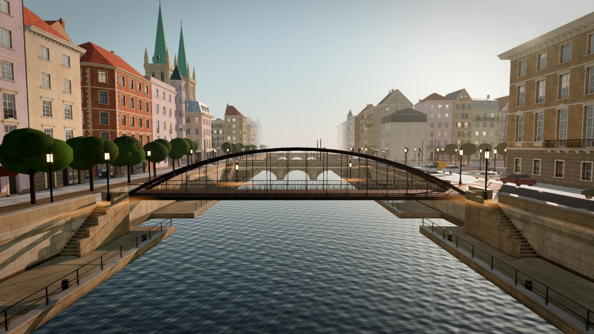 |
| Market square and fountain, the town hall behind | The river, its quays, the footbridge and a stone bridge |
| 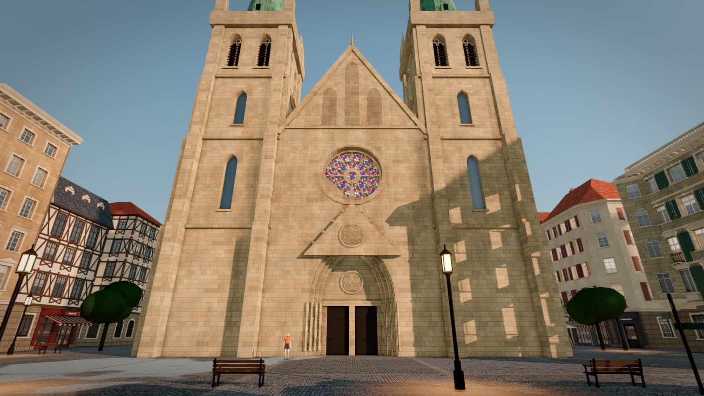 | 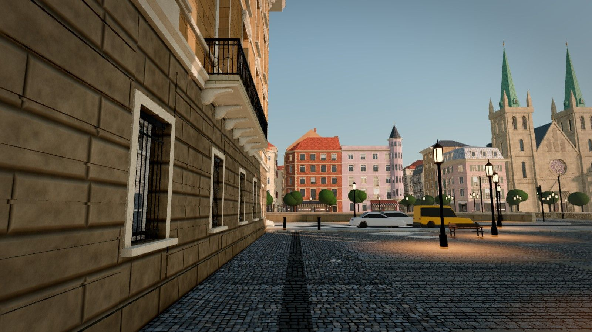 |
| The cathedral front on the Domplatz | A cobbled lane opening onto the river |
| 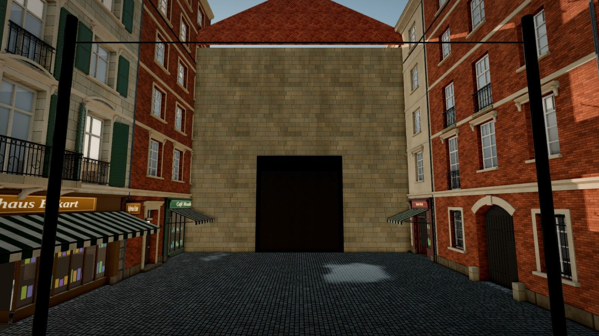 | 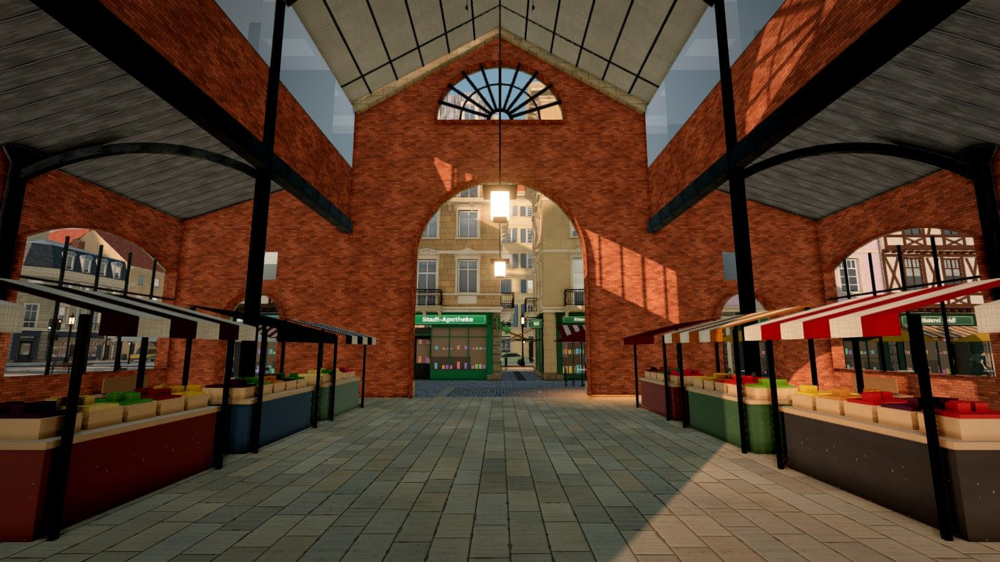 |
| A street running out to its gate tower | Inside the market hall |
| 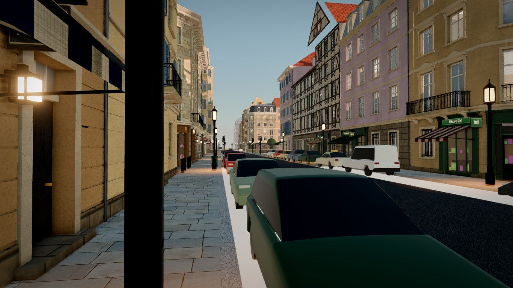 | 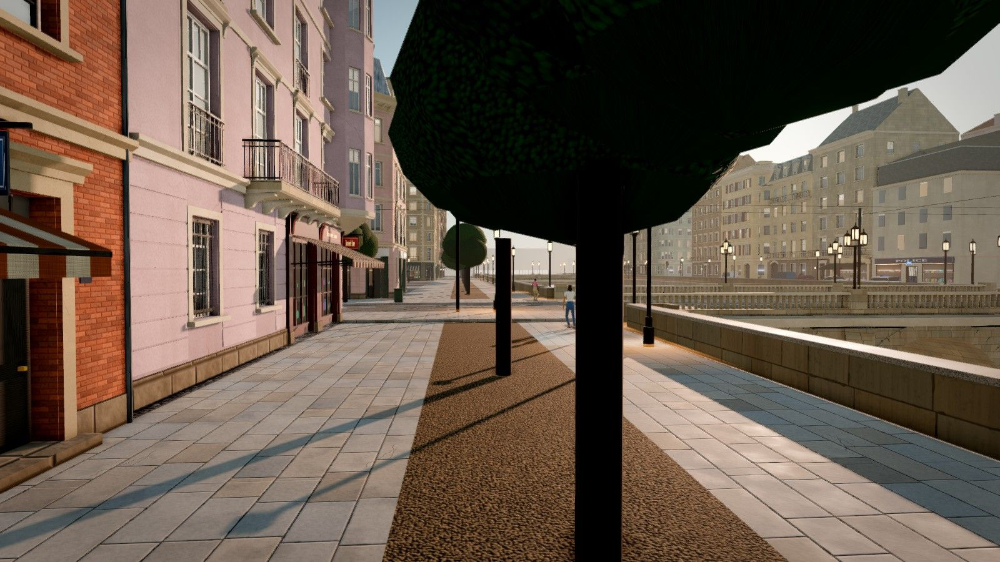 |
| A street with parked cars at eye level | Lanterns on the river promenade |
| 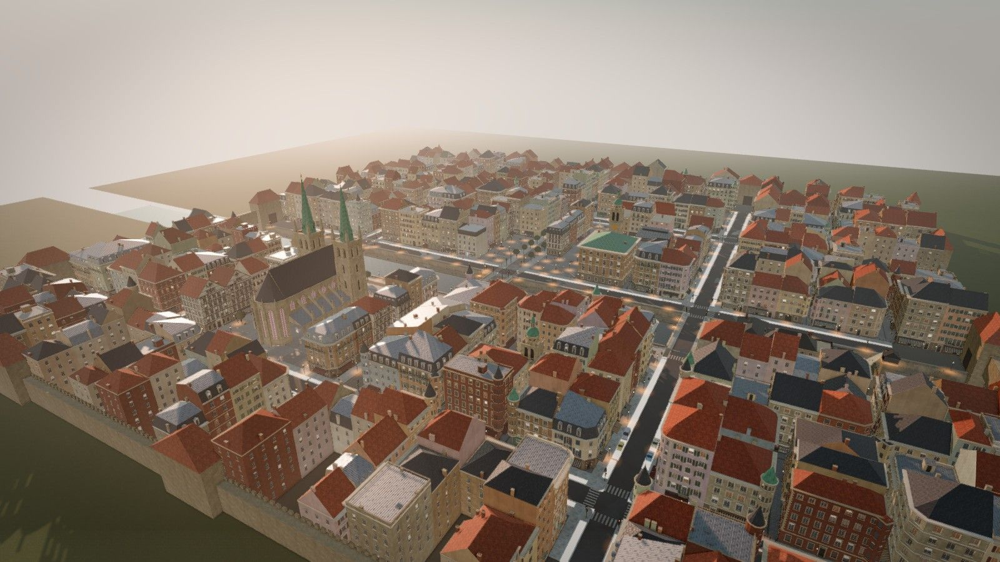 | 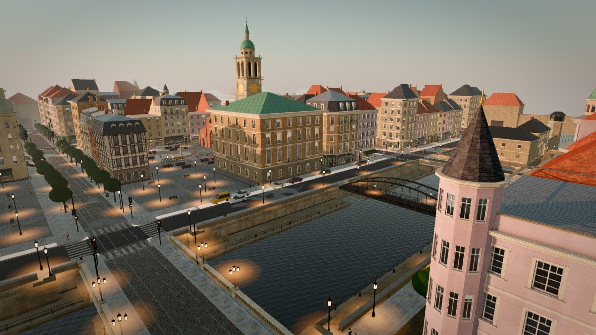 |
| Over the roofs from the north | Golden hour over the river and the town hall |

From the standalone viewer in this repository, exactly what you get out of the box (parked cars
are simple stand-ins here; the game has real ones):

| | |
|---|---|
| 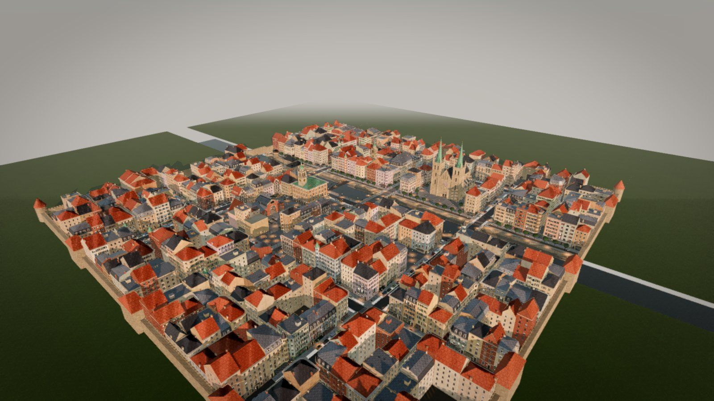 | 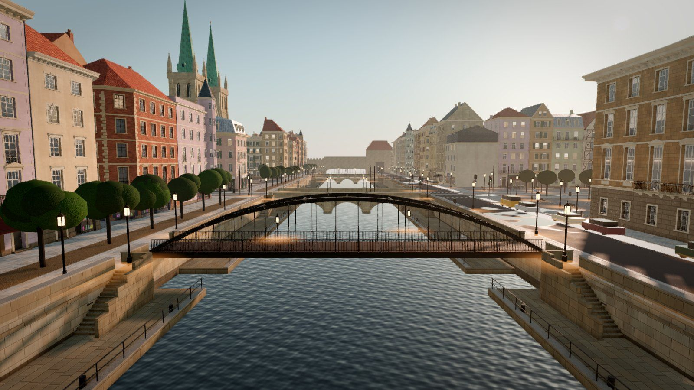 |
| 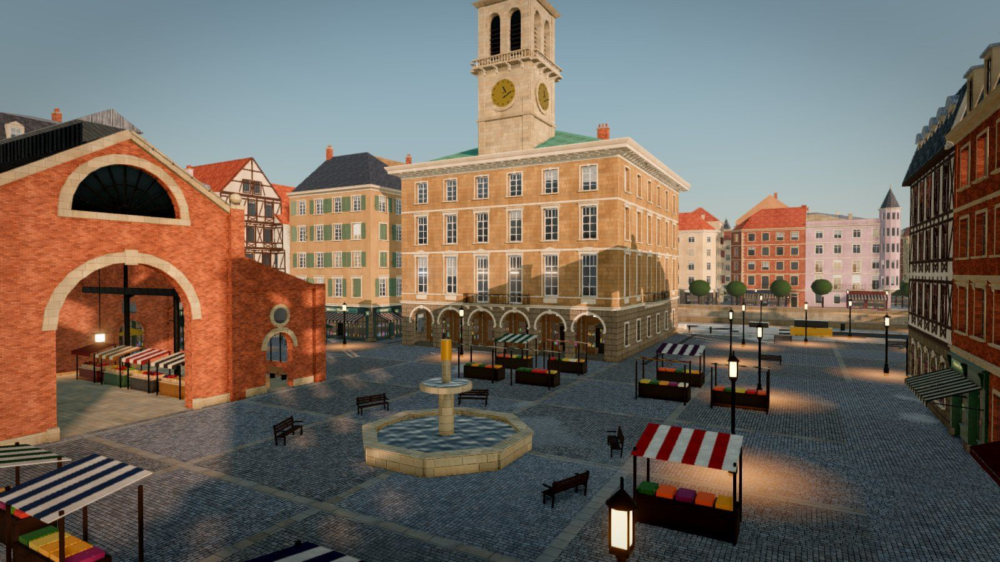 | 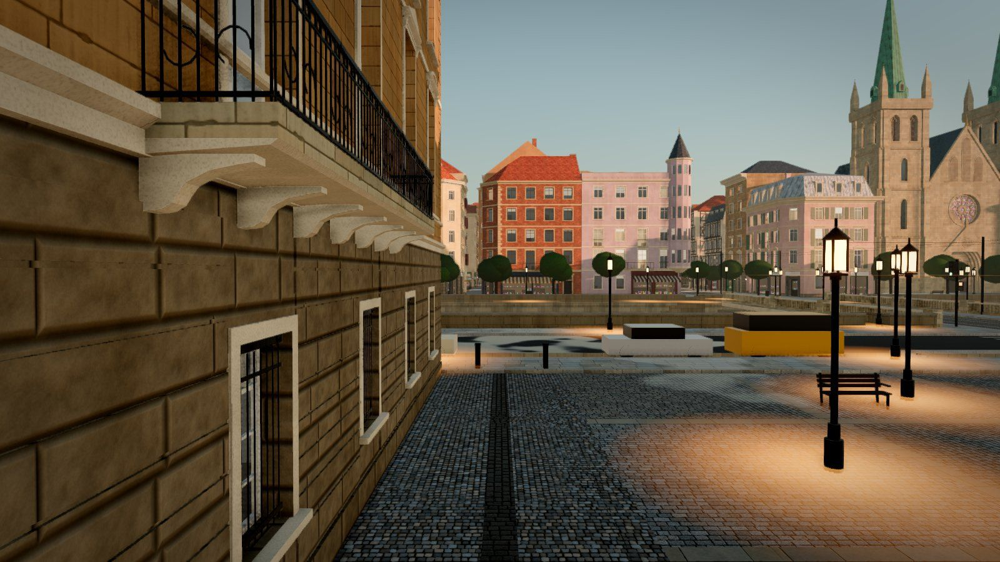 |
| 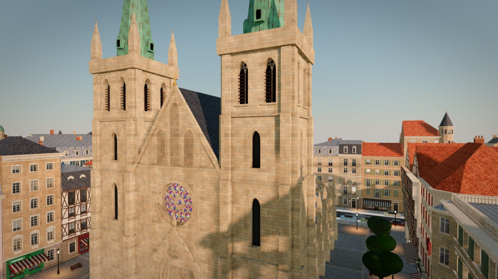 | 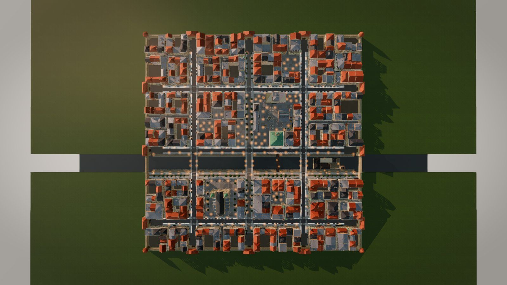 |

## What is in this repository

```
README.md                 this file
LICENSE                   MIT License
PROMPT.md                 the master prompt: how to run and integrate the code, plus the full design spec
PROMPTS/                  shorter prompts, one topic each (layout, buildings, landmarks, streets, lighting, integration)
code/                     the generator: plain ES modules on three.js 0.169
  index.js                public entry: buildOldTown(), planToJSON(), bakeForExport(), makePost(), makeRenderer()
  oldtown/                the town: plan, streets, river, bridges, buildings, landmarks, furniture, jail
  world/                  sky, lamp glow, far shadows, procedural textures
  engine/                 materials and instancing, sky and sun, post-processing, tone curve, collision output
  export/                 the plan as JSON, the town as plain meshes for .glb
  PROVENANCE.md           where every file comes from
  GAME_COMMIT             the game commit this pack was exported from
viewer/index.html         fly around the town, change the time of day, export .glb and .json
data/oldtown-plan.json    the whole town as data: streets, squares, lots, landmarks, furniture, collision
data/oldtown-medium.glb   the static town as one 3D model (medium detail, Draco-compressed, 10 MB)
previews/                 pictures from the game and from the viewer
tools/export-from-game.py for Louis: re-export the map from his private game checkout
index.html                redirects to the viewer
```

## How to use it

1. **Get it and serve it.** Any static web server works; there is no build step and nothing to
   install.

   ```sh
   git clone https://github.com/Louistuis/AltstadtAuto-OldTown-MapPack.git
   cd AltstadtAuto-OldTown-MapPack
   python3 -m http.server 8080        # or: npx serve .
   ```

2. **Open the viewer** at http://localhost:8080/viewer/ in a desktop browser with WebGL2
   (Chrome, Edge, Firefox or Safari). It loads three.js 0.169 from jsDelivr, so it needs internet
   access. The town builds in a few seconds; the textures sharpen a moment later as a worker
   finishes painting them.
   - Drag to orbit, right-drag to pan, scroll to zoom. W A S D to fly, Q and E for down and up,
     Shift to go faster.
   - The buttons jump to the aerial view, the market square, the river, the cathedral, a lane at
     dusk and a plan view. The menus change the time of day and the post-processing quality.
   - **Export .glb** saves the town as a plain 3D model (medium or high detail).
     **Export plan .json** saves the plan.
   - URL options: `?seed=123` (a different town), `&view=market`, `&time=golden`, `&quality=ultra`.
3. **Read [PROMPT.md](PROMPT.md).** It explains how the code fits together, file by file, and is
   written so you can paste it straight into an AI coding agent along with this repository. Part B
   is the full design spec with the real numbers, for a rebuild in another language.
4. **Look things up** in [data/oldtown-plan.json](data/oldtown-plan.json) (positions in metres)
   and in the code: `code/oldtown/plan.js` is the layout, `code/oldtown/buildings/house.js` the
   townhouses, `code/oldtown/buildings/landmarks.js` the cathedral, market hall and town hall,
   `code/oldtown/furniture.js` the lanterns, trees and everything on the streets.

## For Matt and BridgeMind: bringing it into BridgeZone

### If BridgeZone runs on three.js

1. Copy the `code/` folder into BridgeZone, for example as `src/maps/oldtown/`.
2. Make sure `three` and `three/addons/` resolve to BridgeZone's three.js (an import map, or the
   bundler's normal `node_modules` resolution). It is tested on three.js 0.169 and uses nothing
   newer than 0.160. The texture worker is created with
   `new URL('./surfaceworker.js', import.meta.url)`, which Vite, webpack 5 and esbuild handle.
3. Build the town once when the level loads:

   ```js
   import { buildOldTown } from './maps/oldtown/index.js';

   const map = buildOldTown(scene, renderer, {
     seed: 20261004,   // the town in the pictures; any other number gives a different town
     sky: true,        // false keeps BridgeZone's own sky and lights
     jail: true,       // false leaves out the island jail
   });
   // map.group is a THREE.Group with the whole town, already added to the scene
   ```

4. In the game loop call `map.update(dt, camera)`. It swaps near and far detail around the
   camera, moves the sun's shadow box along and runs the traffic lights.
5. **Physics**: `map.colliders.solids` is a list of static boxes `{ type: 'box', x, y, z, w, h, d }`
   (centre and full size) and upright cylinders `{ type: 'cyl', x, y, z, r, h }`. That is the
   whole physics world, so it loads into Rapier, cannon-es, Ammo or PhysX as fixed bodies in one
   loop. For a simple character controller, `map.colliders.boxes` and `circles` are the walkable
   tops (footprint plus height).
6. **Spawn** the player at `map.spawn` on the market square, facing `map.spawnYaw`. Other useful
   lists: `map.walk.lines` (where people walk, for NPCs), `map.seats` (benches and cafe chairs),
   `map.parking` (where cars are parked: spawn BridgeZone's own vehicles there) and `map.lamps`.
7. **Placement and scale**: to put the town somewhere in a bigger world, move `map.group` and add
   the same offset to the collider positions. If BridgeZone's unit is not one metre, scale both by
   the same factor. If it is z-up, rotate the group -90 degrees about x.
8. **Look**: for the game's full dusk look, render through the post chain the viewer uses
   (`makePost(renderer, scene, camera)` and `makeRenderer()` from `code/index.js`; see
   `viewer/index.html`, about 200 lines). Without it the town still renders correctly with
   BridgeZone's own renderer settings.

### If BridgeZone runs on another engine

- Start from [data/oldtown-medium.glb](data/oldtown-medium.glb): the whole static town (seed
  20261004, medium detail, 5.5 million vertices) as plain meshes with vertex colours (no
  textures, no custom shaders), one mesh per material per 64 m tile, in metres with y up. It is
  Draco-compressed to 10 MB; Unity (glTFast), Babylon.js,
  PlayCanvas, three.js (with DRACOLoader) and Blender read Draco. For an engine without Draco,
  decompress it once: `npx @gltf-transform/cli copy data/oldtown-medium.glb out.glb` (about
  176 MB uncompressed).
- For another seed or high detail, open the viewer and press **Export .glb**. The export is
  uncompressed (about 190 MB at medium detail); compress it with
  `npx @gltf-transform/cli draco in.glb out.glb`.
- Take the colliders, spawn point, seats, parked cars, lamps and walking lines from
  `data/oldtown-plan.json` (same formats as above). The lamps are good places for point lights or
  light probes.
- Rebuild the dusk light with [PROMPT.md](PROMPT.md) Part B, section 9 (sun angle, sky, fog,
  exposure, bloom).
- For a native, fully procedural version (C#, C++, GDScript...), give your AI agent PROMPT.md
  Part B and the `code/` folder: the spec has every number from the code, and the code is there to
  read.

### Or let your AI agent do it

Give the agent this repository and [PROMPT.md](PROMPT.md) (or
[PROMPTS/06-integrate-into-existing-game.md](PROMPTS/06-integrate-into-existing-game.md)) and tell
it which engine BridgeZone uses. The prompt walks it through running the viewer, importing the
builder, wiring the colliders and spawn, scaling, and performance.

### Performance

- Measured in the viewer (high quality): about 1,300 draw calls and 2 million triangles over the
  whole town from the air, 500 to 850 draw calls and 1 to 1.8 million triangles at street level. Everything is instanced or merged, culled per 64 m tile, and the small
  detail only draws within 60 m of the camera.
- Keep calling `map.update(dt, camera)`: without it the near detail never switches off.
- On weaker machines use `post.setQuality('low')` or skip the post chain, pass
  `shadowRes: 1024`, and consider `jail: false`.
- The textures are painted in a web worker; the first frames show their average colours.

## Coordinates and units

- Metres, y up, three.js axes (right-handed). The code calls +z north.
- The walled town spans x and z from -200 to +200. The river runs along x between z = 22 and
  z = 56. The market square is around (42, -45), the cathedral at x -76 to -44, z 88 to 134.
- Heights: river bed y = 0, water 0.62, quays 1.2, streets and squares 4.0, pavements 4.14.
- Seed `20261004` is the town in the pictures and in the game.

## Where the code comes from

The map code was exported from AltstadtAuto's own source (commit `f6105c4`, 2026-10-05, the main
branch after Alpha 2.1; also in [code/GAME_COMMIT](code/GAME_COMMIT)).
[code/PROVENANCE.md](code/PROVENANCE.md) lists every file: most are the game's own map code by
Louis Nordbø with their import paths pointed at this pack; a few small engine pieces
(instancing, collision output, the random generator, simple street props) were written fresh for
the pack so it runs on its own.

Updating the pack from a newer version of the game is Louis's job: the game is closed source, so
[tools/export-from-game.py](tools/export-from-game.py) needs his private game checkout. Readers of
this repository never need it.

## License and credit

The Old Town map pack is free: it is released under the [MIT License](LICENSE), copyright (c) 2026
Louis Nordbø. Anyone may use, change and ship it, in BridgeZone or any other game, commercial or
not. Credit is appreciated wherever the map appears:

> Old Town map by Louis Nordbø, from AltstadtAuto (https://wta.lou15.com).

The MIT License covers this repository only. The AltstadtAuto game itself (its vehicles, people,
gameplay, music, sounds and fonts) is closed source and not part of this pack.

three.js (MIT) is loaded from a CDN at runtime and is not part of this repository.

## Thank you

Matt, thank you for the idea of bringing my map into BridgeZone. It honestly made my day. I love
your videos and streams, and I have learned so much from the BridgeMind community on Discord. A
lot of how I build things now, this town included, comes from what I picked up there. I hope the
Old Town finds a good home in BridgeZone, and I can't wait to see where you take it.

Louis Nordbø
